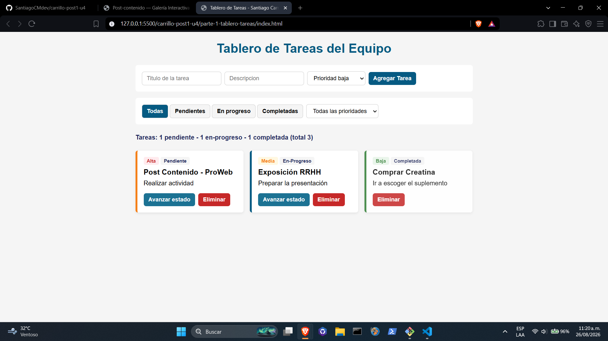
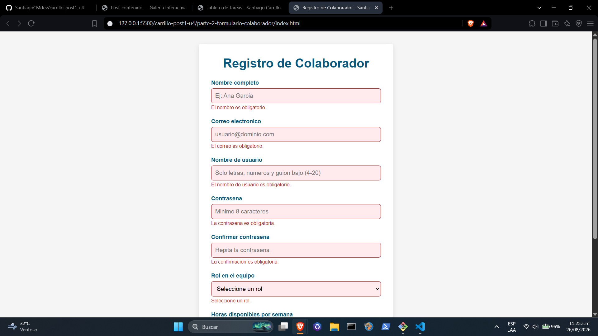
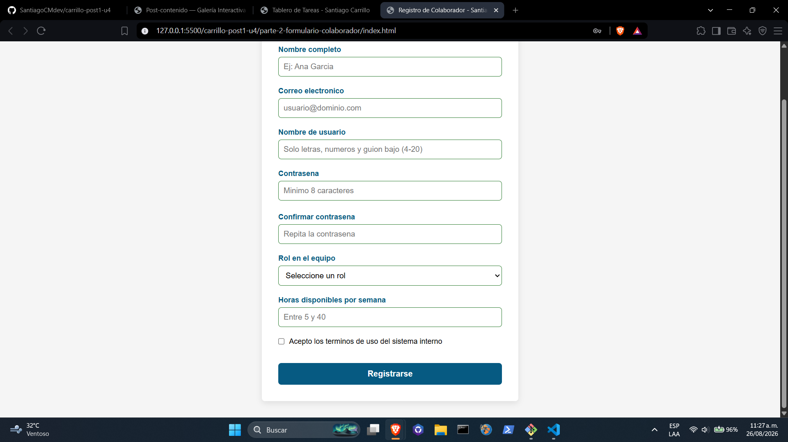

# Post-contenido - Unidad 4: JavaScript Basico

## Informacion del Estudiante
* **Nombre:** Santiago Carrillo
* **Codigo:** 02230132036
* **Semestre:** Septimo Semestre - Ingenieria de Sistemas

## Descripcion
Repositorio del laboratorio de la Unidad 4 de Programacion Web. Contiene dos aplicaciones desarrolladas con JavaScript puro (ES6+): un tablero interactivo de tareas de equipo con delegacion de eventos y closures (parte-1-tablero-tareas/), y un formulario de registro con validacion nativa y Constraint Validation API (parte-2-formulario-colaborador/).

## Parte 1 - Tablero de tareas del equipo
Construccion y administracion de tarjetas de tareas. Implementa un generador de identificadores unicos mediante closures, clasificacion por prioridad usando la estructura switch, filtros combinados por estado y prioridad en el DOM, actualizacion de estados mediante delegacion de eventos en un unico listener y calculo dinamico de metricas con reduce() y for...of.

## Parte 2 - Formulario de registro de colaborador
Formulario de registro avanzado con validacion del lado del cliente. Utiliza la Constraint Validation API (valueMissing, typeMismatch, patternMismatch, rangeUnderflow, rangeOverflow), verificacion de longitud y reglas compuestas en contrasenas, campo condicional dependiente del rol y retroalimentacion en tiempo real con indicador de fortaleza de clave.

## Decisiones de Diseno

### Parte 1 - Generador de ID
Se selecciono la **Estrategia A (closure / patron modulo)**. Esta opcion encapsula la variable `contador` dentro del ambito lexico de la funcion, asegurando que ningun otro componente del codigo pueda modificarla o reiniciarla accidentalmente, a diferencia de una variable declarada con `let` a nivel global.

### Parte 1 - Actualizacion del DOM al avanzar estado
Se eligio la **Estrategia A (actualizacion dirigida)**. Al avanzar una tarea, el sistema ubica el elemento exacto mediante `querySelector` y altera unicamente sus clases y su etiqueta de estado. Esto evita el coste computacional innecesario de destruir y reconstruir toda la estructura del DOM en el contenedor.

### Parte 2 - Validacion de contrasena
Se opto por la **Estrategia B (validaciones independientes encadenadas)**. Al evaluar mayusculas, numeros y caracteres especiales mediante condicionales separados, el sistema provee mensajes de retroalimentacion puntuales al colaborador sobre que requisito especifico no cumple, en lugar de un mensaje generico.

### Parte 2 - Campo condicional "equipo a cargo"
Se implemento la **Estrategia A (alternar el atributo required nativo)**. Al cambiar la propiedad `required = true/false` en el evento `change` del rol, se integra el campo a la Constraint Validation API nativa del navegador, manteniendo la logica estandarizada con el resto del formulario.

## Como visualizar el proyecto
1. Clonar el repositorio: `git clone <URL_REPOSITORIO>`
2. Abrir la carpeta raiz en Visual Studio Code.
3. Hacer clic derecho sobre `parte-1-tablero-tareas/index.html` o `parte-2-formulario-colaborador/index.html` y seleccionar **Open with Live Server**.

## Capturas de pantalla

